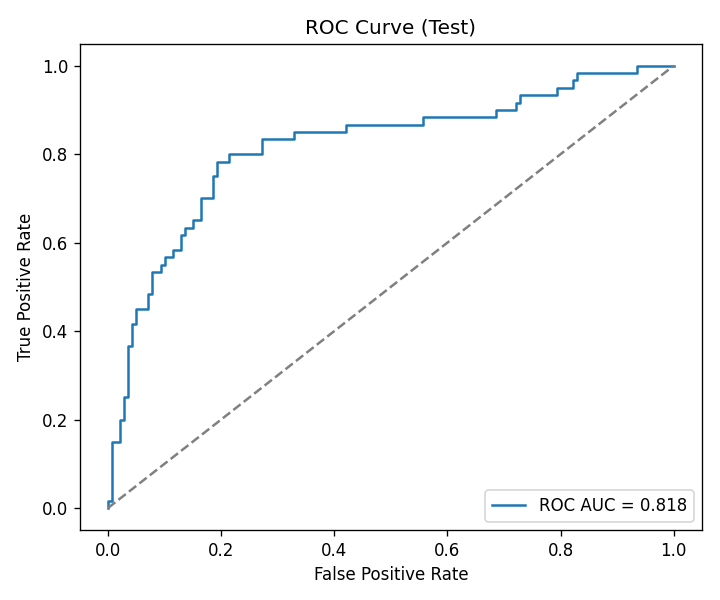

# Credit Model Validation — Mini MRM Pack

I built this project to practice the kind of work that happens **after a credit model has been developed**: checking whether the data are reliable, whether the model can be reproduced, how well it performs, and what limitations would matter before anyone relied on it.

The model itself is intentionally simple — a logistic-regression Probability of Default (PD) model using the German Credit dataset. The main point of the project is the **validation process around the model**, not building the most complicated algorithm possible.

For me, this was a useful way to connect econometrics and Python with the more practical questions that come up in model risk: *Can I reproduce the model? Do the outputs make sense? What could go wrong? What would I want to monitor?*

## What I did

I treated the project as a small model-risk review from raw data through a written validation conclusion.

1. **Checked the data** for missing values, duplicates, and unusual distributions.
2. **Built a reproducible modeling table** with SQL so the path from raw data to the analysis dataset is clear.
3. **Trained a baseline PD model** using logistic regression with categorical encoding.
4. **Tested discrimination** using AUC and KS to see whether the model separates higher- and lower-risk observations.
5. **Checked calibration** with the Brier score and a calibration curve to see how predicted probabilities compare with observed outcomes.
6. **Checked score stability** with Population Stability Index (PSI).
7. **Wrote a validator-style memo** explaining the results, limitations, and what would still be required before production use.

## Main results

On the held-out test sample, the model produced:

- **AUC:** 0.818
- **KS:** 0.590
- **Brier score:** 0.147
- **PSI (train vs. test):** 0.018

These results are useful for a demonstration model, but I would **not** interpret them as evidence that the model is production-ready. The dataset is a public benchmark, the split is random rather than time-based, and the PSI comparison is therefore not a true production drift test.

## Start here: where to see the outputs

If you only want to review the finished work, these are the most useful files:

- **[Validation memo](reports/validation_memo.md)** — the main deliverable and the best place to understand my validation conclusion.
- **[ROC curve](reports/figures/roc_curve_test.png)** — visualizes discrimination on the test sample.
- **[Calibration curve](reports/figures/calibration_curve_test.png)** — compares predicted probabilities with observed outcomes.
- **[Score distribution](reports/figures/score_hist_test.png)** — shows the distribution of model scores.
- **[Validation metrics](outputs/metrics/validation_metrics.json)** — numerical validation results.
- **[QC outputs](outputs/metrics/)** — data-quality checks and supporting tables.
- **[Saved model](outputs/models/logit_pd_pipeline.joblib)** — fitted sklearn pipeline.

### Example output



## Skills demonstrated

**Model validation · credit risk · Python · SQL · data-quality controls · calibration and discrimination testing · model documentation**

## Repository structure

```text
mini-mrm-credit-validation-pack/
├── src/                         # ingestion, QC, table build, training, validation
├── sql/                         # reproducible ETL
├── data/
│   ├── raw/                     # raw dataset snapshot
│   └── processed/               # analysis-ready modeling table
├── outputs/
│   ├── models/                  # saved sklearn pipeline
│   ├── metrics/                 # QC and validation metrics
│   └── logs/                    # training metadata
└── reports/
    ├── figures/                 # ROC, calibration, score plots
    └── validation_memo.md       # final validation write-up
```

## Reproducing the project

```bash
python -m venv .venv
source .venv/bin/activate
pip install -r requirements.txt

python -m src.ingest
python -m src.qc
python -m src.build_table
python -m src.train
python -m src.validate
```

## What I would add next

For a more realistic validation exercise, I would use time-indexed credit data, run true out-of-time testing, establish formal monitoring thresholds, add segmentation and fairness analysis, and compare the baseline model with a challenger.

## Other projects

A few other pieces of my applied economics / risk analytics work:

- **[Monetary Policy & Equity Market Volatility](https://github.com/alelancia14/monetary-policy-volatility)** — GARCH, VAR, impulse responses, and sector-level market risk.
- **[COVID-19 Lockdowns and Air Quality](https://github.com/alelancia14/lockdown-air-quality)** — difference-in-differences, event studies, and robustness testing.
- **[Money Supply, Bitcoin & Gold](https://github.com/alelancia14/btc-gold-liquidity-study)** — time-series analysis, regime splits, and a null result that weakened under additional testing.

## About me

I’m **Alessandro Lancia**, an MS Economics (Data Science) student at Northeastern University. I’m especially interested in model risk, risk analytics, and applied econometrics — work where the technical result matters, but so does being able to explain what it means and where it can fail.

[GitHub profile](https://github.com/alelancia14)
